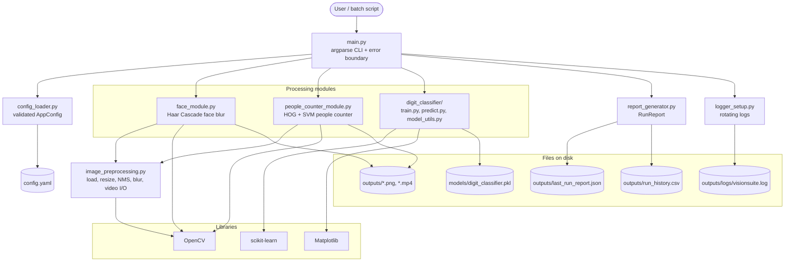

# 1. System Architecture

VisionSuite is a layered command-line application. `main.py` is the only entry
point; it loads the configuration, then dispatches to one of three independent
processing modules. Shared helpers and the reporting/logging layer are used by
every module.

