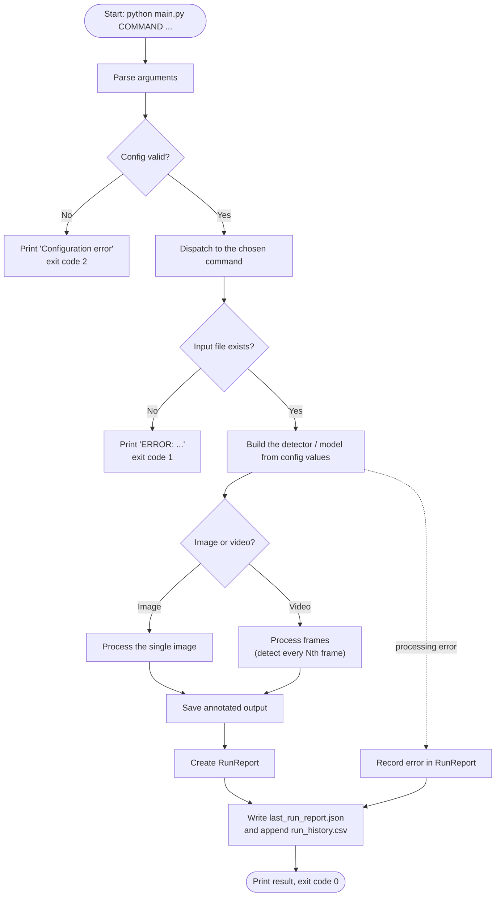

# 2. Workflow (what happens on every run)

For `train-digits` the "process" step is: load the dataset, split 80/20, fit the
SVM, evaluate on the held-out 20%, save the model, the text report and the
confusion-matrix image. For `predict-digit` it is: preprocess the image to 8x8,
load the model, return the digit and its confidence.
