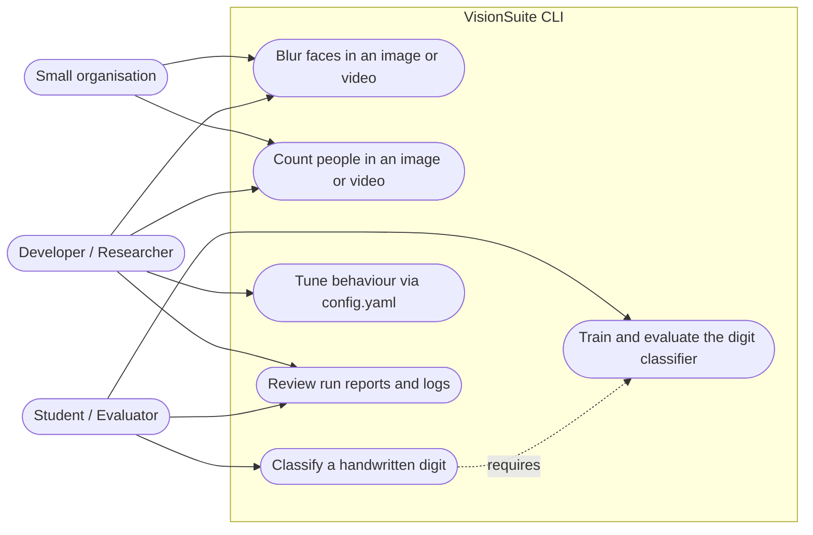

# 3. Use Cases

Mermaid has no dedicated use-case diagram type, so actors and use cases are
drawn as a flowchart.

```mermaid
flowchart LR
    EVAL(["Student / Evaluator"])
    DEV(["Developer / Researcher"])
    ORG(["Small organisation"])

    subgraph SYS["VisionSuite CLI"]
        UC1(["Blur faces in an image or video"])
        UC2(["Count people in an image or video"])
        UC3(["Train and evaluate the digit classifier"])
        UC4(["Classify a handwritten digit"])
        UC5(["Tune behaviour via config.yaml"])
        UC6(["Review run reports and logs"])
    end

    ORG --> UC1
    ORG --> UC2
    DEV --> UC1
    DEV --> UC2
    DEV --> UC5
    DEV --> UC6
    EVAL --> UC3
    EVAL --> UC4
    EVAL --> UC6
    UC4 -. "requires" .-> UC3
```
