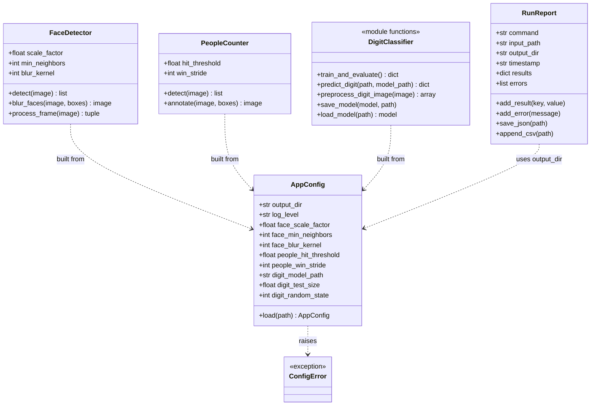

# 4. Class Diagram

```mermaid
classDiagram
    class AppConfig {
        +str output_dir
        +str log_level
        +float face_scale_factor
        +int face_min_neighbors
        +int face_blur_kernel
        +float people_hit_threshold
        +int people_win_stride
        +str digit_model_path
        +float digit_test_size
        +int digit_random_state
        +load(path) AppConfig
    }

    class ConfigError {
        <<exception>>
    }

    class FaceDetector {
        +float scale_factor
        +int min_neighbors
        +int blur_kernel
        +detect(image) list
        +blur_faces(image, boxes) image
        +process_frame(image) tuple
    }

    class PeopleCounter {
        +float hit_threshold
        +int win_stride
        +detect(image) list
        +annotate(image, boxes) image
    }

    class RunReport {
        +str command
        +str input_path
        +str output_dir
        +str timestamp
        +dict results
        +list errors
        +add_result(key, value)
        +add_error(message)
        +save_json(path)
        +append_csv(path)
    }

    class DigitClassifier {
        <<module functions>>
        +train_and_evaluate() dict
        +predict_digit(path, model_path) dict
        +preprocess_digit_image(image) array
        +save_model(model, path)
        +load_model(path) model
    }

    AppConfig ..> ConfigError : raises
    FaceDetector ..> AppConfig : built from
    PeopleCounter ..> AppConfig : built from
    DigitClassifier ..> AppConfig : built from
    RunReport ..> AppConfig : uses output_dir
```
