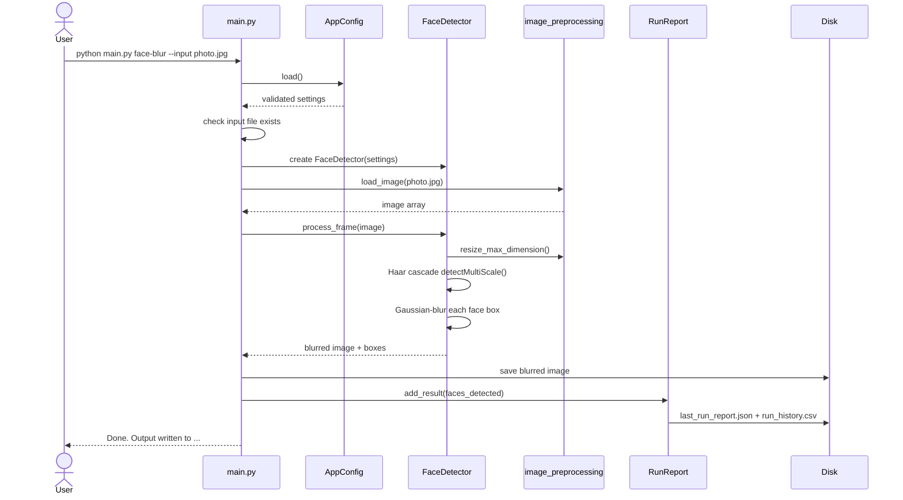

# 5. Sequence Diagram -- `face-blur` on an image

```mermaid
sequenceDiagram
    actor U as User
    participant M as main.py
    participant C as AppConfig
    participant F as FaceDetector
    participant P as image_preprocessing
    participant R as RunReport
    participant D as Disk

    U->>M: python main.py face-blur --input photo.jpg
    M->>C: load()
    C-->>M: validated settings
    M->>M: check input file exists
    M->>F: create FaceDetector(settings)
    M->>P: load_image(photo.jpg)
    P-->>M: image array
    M->>F: process_frame(image)
    F->>P: resize_max_dimension()
    F->>F: Haar cascade detectMultiScale()
    F->>F: Gaussian-blur each face box
    F-->>M: blurred image + boxes
    M->>D: save blurred image
    M->>R: add_result(faces_detected)
    R->>D: last_run_report.json + run_history.csv
    M-->>U: Done. Output written to ...
```
