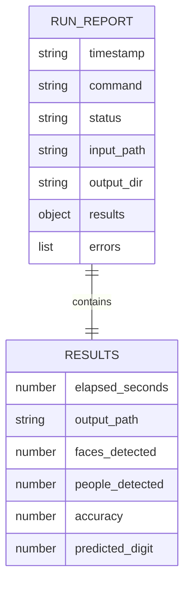

# 6. Storage Schema Design

VisionSuite needs no database. Everything is stored as plain files, which keeps
it portable and easy to audit.

## Files

| Path | Format | Written by | Purpose |
|---|---|---|---|
| `config.yaml` | YAML | user | tunable settings (read-only for the program) |
| `outputs/<name>_face_blurred.png / .mp4` | image / video | `face-blur` | anonymised media |
| `outputs/<name>_people_counted.png / .mp4` | image / video | `count-people` | annotated media |
| `outputs/last_run_report.json` | JSON | every command | summary of the most recent run (overwritten) |
| `outputs/run_history.csv` | CSV | every command | one row per run (append-only audit trail) |
| `outputs/logs/visionsuite.log` | text | logger | detailed log (rotates at ~1 MB, 3 backups) |
| `outputs/digit_classifier_evaluation.txt` | text | `train-digits` | accuracy, per-class report, confusion matrix |
| `outputs/digit_classifier_confusion_matrix.png` | image | `train-digits` | confusion-matrix plot |
| `models/digit_classifier.pkl` | pickle | `train-digits` | trained SVM + metadata |

## Run report structure

`status` is `success` or `failed` (failed when `errors` is not empty). Only the
result keys relevant to the command are present.

## `run_history.csv` columns

`timestamp, command, status, input_path, elapsed_seconds, results, errors`

`results` holds the same results object as the JSON file, serialised as a JSON
string, so the CSV keeps a fixed set of columns for every command.
